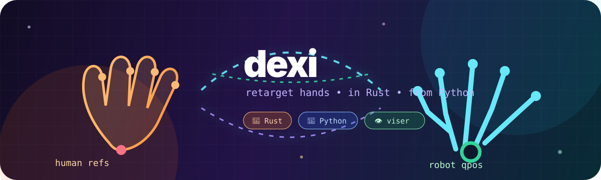

<p align="center">
  
</p>

<h1 align="center">dexi 🦀🤖</h1>

<p align="center">
  <strong>Fast robot-hand retargeting in Rust, shipped to Python as <code>dexi-rs</code>.</strong><br>
  YAML configs + URDFs in, robot joint positions out — with uv examples and 3D viser vibes.
</p>

<p align="center">
  <a href="https://pypi.org/project/dexi-rs/"></a>
  
  
  
</p>

`dexi` maps human-hand position/vector targets onto robot-hand joint positions.
It supports **position**, **vector**, and **DexPilot-style** retargeting for the
bundled hands, while keeping the hot path in a small Rust core and the workflow
friendly from Python.

## Why dexi? ✨

- 🦀 **Rust core** — deterministic retargeting, fast optimizer hot paths, no giant
  Python robotics stack required at runtime.
- 🐍 **Python ergonomics** — `import dexi_rs`, load any YAML config path, call
  `retarget(...)`, keep moving.
- 📦 **Assets included** — robot URDF/mesh assets ship with the wheel; YAML
  configs stay as ordinary files in your repo or app.
- 👁 **Visual feedback** — uv-runnable `viser` example with a live URDF hand model, wrist axes, and fingertip targets.
- 🧪 **Maintainer-grade parity checks** — Python-vs-Rust comparison tooling keeps
  the implementation honest.
- 🛠 **Vibecoding-friendly** — `just setup`, `just preflight`, readable docs,
  small examples, and clear release scripts.

## Install 🚀

```bash
uv pip install dexi-rs
```

For local development from a checkout:

```bash
just setup
just build
just test-wheel
```

## Quickstart

Tiny target-vector retargeting example:

```python
import numpy as np
import dexi_rs

config = dexi_rs.load_config("configs/teleop/allegro_hand_right.yml")
retargeting = config.build()

# Allegro vector configs expect four wrist-to-fingertip vectors, flattened.
target_vectors = np.array(
    [
        [0.03, -0.02, 0.08],
        [0.04, 0.00, 0.09],
        [0.03, 0.02, 0.085],
        [0.02, 0.04, 0.07],
    ],
    dtype=float,
)

qpos = retargeting.retarget(target_vectors.reshape(-1).tolist())
print(dict(zip(retargeting.joint_names, qpos)))
```

Run the same example through uv:

```bash
uv run examples/quickstart.py
```

## Supported hands and configs 🖐️

Example configs live under `configs/` in this repository. They are normal YAML
files, so copy/edit them in your own project and pass their filesystem path to
`dexi_rs.load_config(...)`.

| Family | Configs |
| --- | --- |
| Allegro | left/right, vector, position, DexPilot |
| Shadow | left/right, vector, position, DexPilot |
| Schunk SVH | left/right, vector, position, DexPilot |
| LEAP | left/right, vector, position, DexPilot |
| Ability | left/right, vector, position, DexPilot |
| Inspire | left/right, vector, position, DexPilot |
| Fourier | left/right, 6DOF + 12DOF vector |
| Panda gripper | vector, position, DexPilot |

List configs in a checkout:

```python
import dexi_rs
print(dexi_rs.available_configs("configs"))
```

## Examples you can run with uv ⚡

All examples are in `examples/` and are designed to run with uv.

```bash
uv run examples/list_configs.py
uv run examples/quickstart.py
uv run examples/batch_retarget.py
uv run examples/joint_order.py
uv run examples/visualize_viser.py --smoke-test
uv run examples/visualize_viser.py
uv run examples/vector_retarget_viser.py --smoke-test
```

The non-smoke `visualize_viser.py` command starts a local browser-based 3D
viewer, loads the Fourier 6DOF URDF hand model by default, applies the retargeted joint
configuration, and overlays the wrist axis plus fingertip targets. It does not
render videos or SVG files.

Visualizer presets include both Fourier and Allegro hands:

```bash
uv run examples/visualize_viser.py --robot fourier --dof 12dof
uv run examples/visualize_viser.py --robot allegro
```

For video/webcam retargeting, `vector_retarget_viser.py` tracks a human hand,
updates the URDF robot hand, and shows the camera frame, tracked landmarks,
fingertip targets, actual fingertips, and residuals in the same viser scene:

```bash
uv run examples/vector_retarget_viser.py --video path/to/hand_video.mp4
uv run examples/vector_retarget_viser.py --webcam 0
```

Fourier is the default live-demo convention (`+x` to thumb, `-y` out of palm,
`+z` toward wrist) and uses all five fingertips. Allegro remains available with
its own transform and four-tip mapping:

```bash
uv run examples/vector_retarget_viser.py --robot allegro --transform-convention allegro
uv run examples/vector_retarget_viser.py --robot fourier --dof 12dof --tip-order thumb,index,middle,ring,pinky
```

```bash
uv run examples/visualize_viser.py
# open the printed local URL, then orbit the retargeted hand in your browser
```

## Documentation map 🗺️

- [Installation](docs/installation.md)
- [Usage guide](docs/usage.md)
- [Configuration guide](docs/configuration.md)
- [API reference](docs/api.md)
- [Examples guide](docs/examples.md)
- [FAQ](docs/faq.md)
- [Release and publishing](docs/release.md)

## Development loop 🧰

```bash
just setup
just fmt
just test
just build
just check-dist
just test-wheel
just examples
just preflight
```

## Open source notes 🌱

Code is distributed under the MIT License. Bundled robot configs and URDF assets
include third-party materials; see [THIRD_PARTY_NOTICES.md](THIRD_PARTY_NOTICES.md).

If you build something weird with robot hands, tactile teleop, or dexterous
manipulation experiments, this repo is meant to be hackable: open an issue, fork
the configs, wire it into your own perception stack, and make the hands move.
